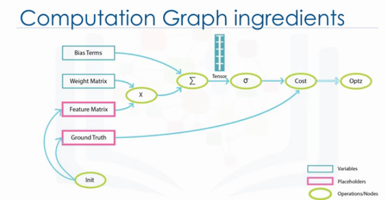
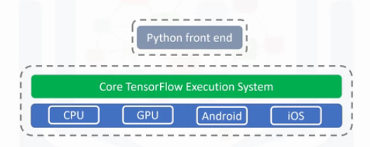

### Learning Objectives
* __Introduction to TensorFlow__
* __TensorFlow's Hello World__
* __Linear Regression with Tensorflow__
* __Non-Linear Regression with Tensorflow__
* __Logistic Regression with Tensorflow__
* __Activation Functions__

___

**What is Tensorflow?**
* TF is a opensource library developed by the __Google Brain Team__.

* Extremely versatile library, originally created for tasks that require heavy numerical computations. For this reason, TF was geared towards the problem of **machine learning**, and **deep neural networks**.

* Backend is C/C++, so it runs faster than pure Python code

* Tensorflow applications uses a structure known as __data flow graph__, which is very useful to first build and then execute it in a session. It is also a very common programming model for __parallel computing__.

___

__Advantages of TF for an applications__

* Provides Python and C++ api.
* Python API is more complete and easier to use.
* Faster compilations times in comparision to the alternative deep learning libraries.
* Supports __CPUs, GPUs, and even distributed processing in a cluster__. It as a very important feature as you can train neural network using CPU and multiple GPU, which makes the models very efficient on large-scale systems.

___

__What is a dataflow graph?__

TF's strucutre is based on the execution of a data flow graph.
__Data Flow graph__ has two basic units.
1. __Nodes__: That represents a mathematical operation.
2. __Edges__: That represents the multi-dimensional arrays, know as __Tensors__.

__Benefit of Dataflow graph__ is that we can easily visualize the different parts of the graph, which is not an option on while using other python libraries such as Numpy or Scikit. 

__The standard usage__ is to build a graph first and then execute it in a session.

___

__What is a Tensor?__

The data that's passed between the operations are __Tensors__. In effect, *Tensor* is a __multidimensional array__. It can be _zero dimensional_ such as scalar values, _one dimensional_ as a line or vector, or _2-dimensional_ such as Matrix, and so-on.

__The Tensor Structure__ helps us by giving the freedom to shape the dataset the way we want. It's also helpful when dealing with _images_, due to the nature of how the information within images is encoded.

___

__Computation Graph Ingredients__

As we already know, _nodes_ are called __operations__, which represents the units of computation. And, _edges_ are __tensors__ which represen the data consumed or produced by an operation.

In the figure above, __Feature Matrix__ is a placeholder. Place Holders can be seen as __"holes"__ in your model -- __"holes"__ through which you can pass the data from outside of the graph. 

__Placeholders__ allow to create operations in the graph, without needing the data. When excuting the graph, the placeholders has to be feeded with input data. This is the reason, __we need to _initialize_ placeholders before using them.__

In figure above, lets look at another operation which builds the variables for our program. __Weight Matrix__ is a variable. __TF Varaibles__ are used to share and persist some values, that are manipulated by the program. 

__Important thing to notice__ when _placeholder_ or _variable_ are defined, then __TensorFlow__ adds a operation to graph. In the graph above, __"Weight Matrix"__ and __"Feature Matrix"__ should be multiplied using a __multiplication operation(X)__. After that, __Add operation__ is called which adds the result of the previous operation with bias term.  

__Output__ of each operation is a Tensor. The resulting tensors of each operation crosses the next one until the end where it's possible to get the desired result. After adding all operations in a graph, we can create a session to run the graph, and perform the computations. 

__For better uderstanding__ have a look at below cells.

___

__Architecture of TensorFlow__

TensorFlow's flexible architecture allows you to deploy computation on one or more CPUs, or GPUs, or on a desktop, server, or even a mobile devices. This means you can build your program once and then run you can run it easily on different devices.

__Why Tensorflow for Deep Learning?__

* TF has built in support for deep learning and neural network, so its easy to assemble a net, assign parameters, and run the training process.
* It has a collection of simple, trainable mathematical functions that are useful for neural networks.
* Deep Learning is a gradient-based machine learning algorithm so it can benefit from __TF's differentiation and optimizers.__

___
___
